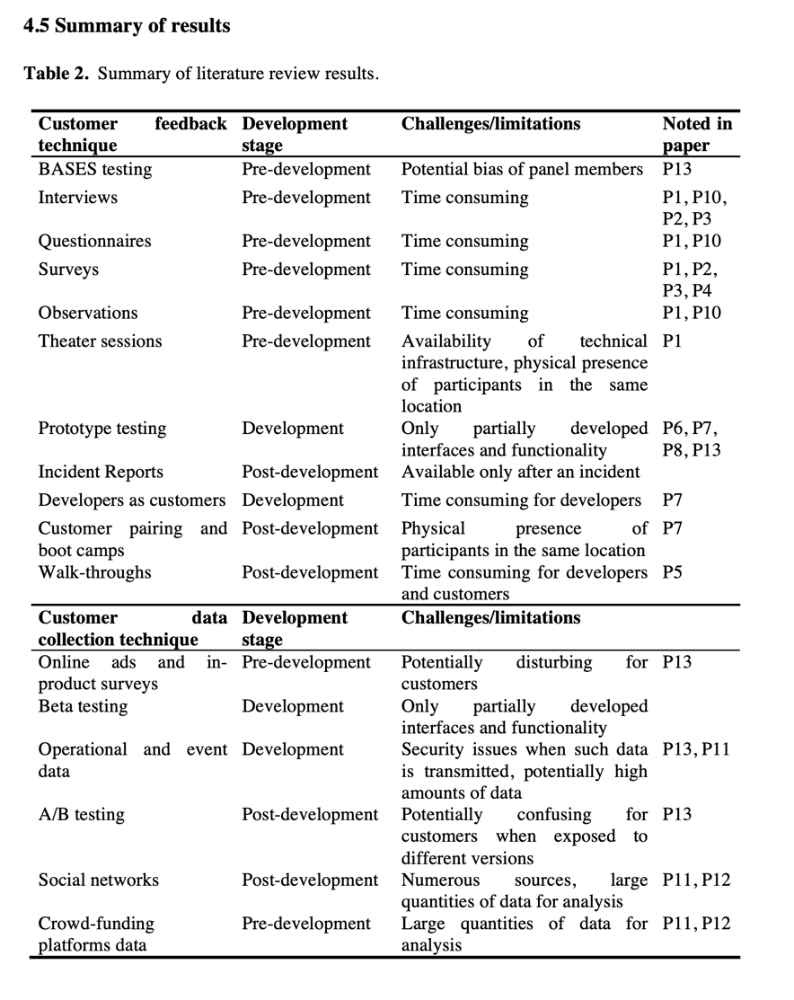

# Feedback Techniques

## A/B Testing
Deploy two versions of the software with 
different features. The evaluated features 
are instrumented to measure their success/performance.

## Offer the user to give feedback
- Element in the UI that offers to give feedback
  - Like or dislike?
  - What could be improved? 
  - "Do you find this feature useful?"

## Incidents Reports
**Only measures incidents!**

# Feedback Metrics
- Could be as simple as how many times 
the feature is used.
- User adoption.
- Conversion rate.
- Click-through rate.
- Bounce rate.

## "HEART" metrics
**H**: Happiness
**E**: Engagement
**A**: Adoption
**R**: Retention
**T**: Task Success
### Happiness
Customer satisfaction.
### Engagement
User behavior and level of participation.
### Adoption
User growth.
### Retention
Users continue using it.
### Task Success
**Time-on-task**: where do users spend the most time on our platforms and applications?

# Links
- [Spotify’s New Experimentation Platform (Part 1)](https://engineering.atspotify.com/2020/10/spotifys-new-experimentation-platform-part-1/)
- [Spotify’s New Experimentation Platform (Part 2)](https://engineering.atspotify.com/2020/11/spotifys-new-experimentation-platform-part-2/)
- [A/B Testing Metrics: How to choose your metrics](https://segment.com/growth-center/a-b-testing-definition/metrics/)
- [Developing Meaningful Automated Metrics](https://medium.com/capital-one-tech/capital-one-tech-blog-on-metrics-8a7088fd855b)
